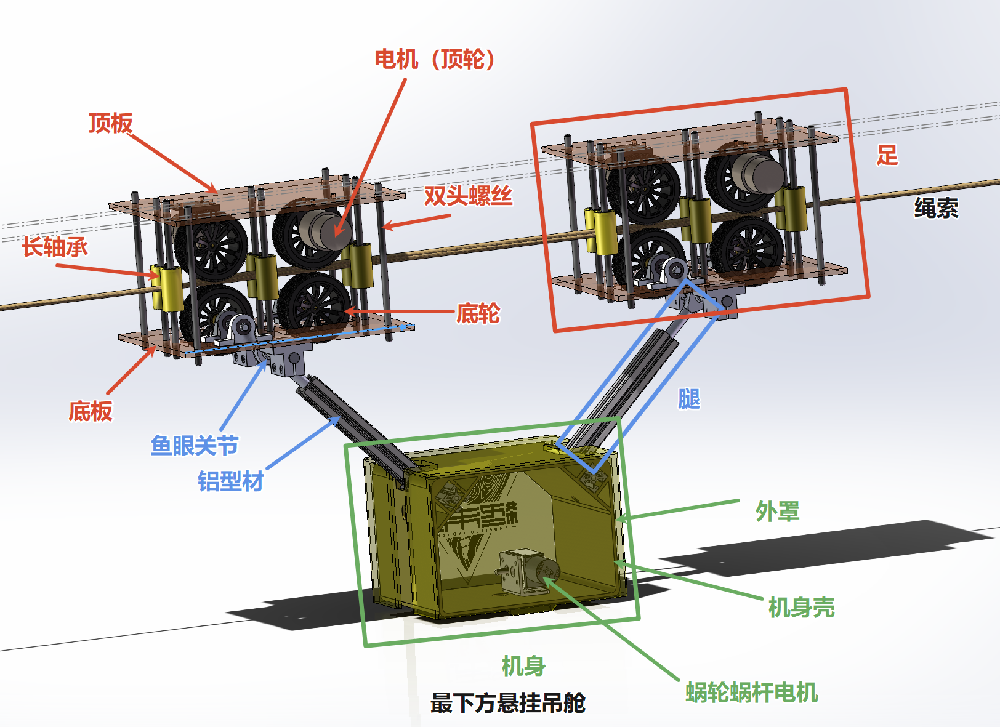
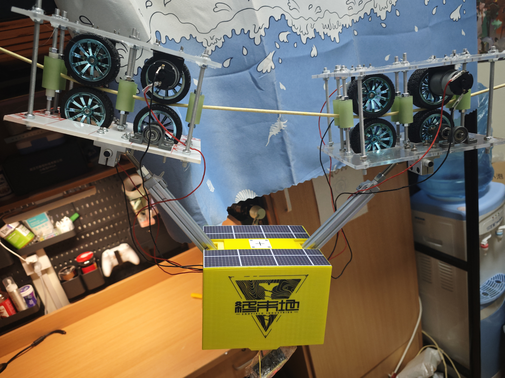

# 滑索机器人 - CableRobot

> 受生物细胞「微管-驱动蛋白」物质运输机制启发，研发的高机动、易部署滑索机器人

## 📖 项目简介

针对校内跨建筑高频物流受限于地面路况与人力成本的痛点，本项目受生物细胞"微管-驱动蛋白"物质运输机制启发，研发了一款高机动、易部署的**滑索机器人**。

整机采用**去中心化的模块化架构**，拆分为足部夹持、腿部关节、机身主控与升降吊舱四个单元：

- **机械设计**：设计了可变径摩擦预紧机构以防止索道打滑，并引入鱼眼轴承实现了大倾角及风载晃动工况下的被动自平衡；吊舱利用蜗轮蜗杆的自锁特性实现了零能耗悬停。
- **电控实现**：通过软件层的高阻态关断策略，硬件层的双主控桥接通信与三级供电网络，提升了系统的抗干扰能力与运行可靠性。

## 📸 机器人外观

| CAD 渲染图 | 实物照片 |
|:---:|:---:|
|  |  |

## 🎯 性能指标

| 指标 | 参数 |
|------|------|
| 有效负载 | 最高 **3 kg** |
| 行进速度 | 最高 **0.7 m/s** |
| 最大爬升角度 | **45°** |
| 安全冗余 | 通过落锤冲击试验，结构保持完好 |

## 🏭 应用场景

- 🏫 校园点对点快递
- 🏭 工业抵近检视
- 🌾 智慧农业喷灌
- ⛰️ 城市、山区等复杂地形物流

滑索机器人为复杂地形下的物流提供了一套**低成本、高能效**的工程实践方案。

## 📁 仓库文件

| 文件 | 说明 |
|------|------|
| `控制系统代码.zip` | 滑索机器人控制系统源代码 |
| `滑索机器人装配体.zip` | 三维装配体模型文件 |
| `滑索机器人结项报告.pdf` | 项目结项报告（PDF） |
| `滑索机器人结项报告.docx` | 项目结项报告（Word） |
| `滑索机器人宣传视频.mp4` | 项目宣传视频 |
| `视频素材.zip` | 项目视频素材合集 |
| `课程汇报PPT.zip` | 课程汇报演示文稿 |

## 🚀 快速开始

1. 下载 `控制系统代码.zip` 获取源代码
2. 下载 `滑索机器人装配体.zip` 获取三维模型
3. 参考 `滑索机器人结项报告.pdf` 了解详细设计与实现

## 👤 作者

**许传岳 (Xu Chuanyue)**

📧 cone2540@sjtu.edu.cn

## 📄 许可证

本项目代码部分采用 [GNU General Public License v3.0](LICENSE) 协议开源。

- **源代码**：GPL v3 — 可自由使用、修改、分发，但衍生作品必须同样以 GPL v3 开源。
- **文档/模型/视频**：CC BY-SA 4.0 — 署名-相同方式共享。

```
Copyright (C) 2024 许传岳 (Xu Chuanyue) <cone2540@sjtu.edu.cn>
```

---

*CableRobot - Biomimetic Cableway Logistics Solution*
